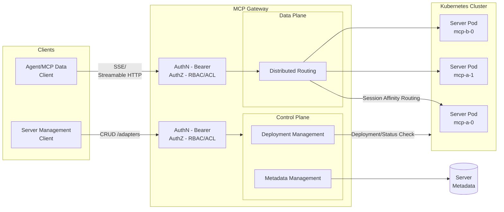

# MCP Gateway

**MCP Gateway** is a reverse proxy and management layer for [Model Context Protocol (MCP)](https://modelcontextprotocol.io/introduction) servers, enabling scalable, session-aware routing and lifecycle management of MCP servers in Kubernetes environments.

## Overview

This project provides:

- A data gateway for routing traffic to MCP servers with session affinity.
- A control plane for managing the MCP server lifecycle (deploy, update, delete).
- Enterprise-ready integration points including telemetry, access control and observability.

## Key Concepts

- **MCP Server**: A server implementing the Model Context Protocol, which typically exposes SSE or streamable HTTP endpoints.
- **Adapters**: Logical resources representing MCP servers in the gateway, managed under the `/adapters` scope. Designed to coexist with other resource types (e.g., `/agents`) in a unified AI development platform.
- **Session-Aware Stateful Routing**: Ensures that all requests with a given `session_id` are consistently routed to the same MCP server instance.

## Architecture



## Features

### Control Plane – RESTful APIs for MCP Server Management

- `POST /adapters` — Deploy and register a new MCP server.
- `GET /adapters` — List all MCP servers the user can access.
- `GET /adapters/{name}` — Retrieve metadata for a specific adapter.
- `GET /adapters/{name}/status` — Check the deployment status.
- `GET /adapters/{name}/logs` — Access the server's running logs.
- `PUT /adapters/{name}` — Update the deployment.
- `DELETE /adapters/{name}` — Remove the server.

### Data Plane – Gateway Routing for MCP Servers

- `GET /adapters/{name}/sse` — Establish an initial SSE connection.
- `POST /adapters/{name}/messages` — Send subsequent requests using `session_id`.
- `POST /adapters/{name}/mcp` — Establish a streamable HTTP connection.

### Additional Capabilities

- Authentication and authorization support (production mode).
- Stateless reverse proxy with a distributed session store (production mode).
- Kubernetes-native deployment using StatefulSets and headless services.

## 🚀 Getting Started

1. **Prepare Local Development Environment**  
   - [Install .NET 8 SDK](https://dotnet.microsoft.com/en-us/download/dotnet/8.0)
   - [Install Docker Desktop](https://docs.docker.com/desktop/)
   - [Install and turn on Kubernetes](https://docs.docker.com/desktop/features/kubernetes/#install-and-turn-on-kubernetes)

2. **Run Local Docker Registry**  
   ```sh
   docker run -d -p 5000:5000 --name registry registry:2.7
   ```

3. **Build & Publish MCP Server Images**  
   Build and push the MCP server images to your local registry (`localhost:5000`).
   ```sh
   docker build -f mcp-example-server/Dockerfile mcp-example-server -t localhost:5000/mcp-example:1.0.0
   docker push localhost:5000/mcp-example:1.0.0
   ```

4. **Build & Publish MCP Gateway**  
   (Optional) Open `dotnet/Microsoft.McpGateway.sln` with Visual Studio.

   Publish the MCP Gateway image by right-clicking `Publish` on `Microsoft.McpGateway.Service` in Visual Studio, or run:
   ```sh
   dotnet publish dotnet/Microsoft.McpGateway.Service/src/Microsoft.McpGateway.Service.csproj -c Release /p:PublishProfile=localhost_5000.pubxml
   ```

5. **Deploy MCP Gateway to Kubernetes Cluster**  
   Apply the deployment manifests:
   ```sh
   kubectl apply -f k8s/deployment.yml
   ```

6. **Enable Port Forwarding**  
   Forward the gateway service port:
   ```sh
   kubectl port-forward -n adapter svc/mcpgateway-service 8000:8000
   ```

7. **Test the API**

   - Import the OpenAPI definition from `openapi/mcp-gateway.openapi.json` into tools like [Postman](https://www.postman.com/), [Bruno](https://www.usebruno.com/), or [Swagger Editor](https://editor.swagger.io/).

   - Send a POST request to `http://localhost:8000/adapters` to create a new adapter resource:
     ```json
     {
       "name": "mcp-example",
       "imageName": "mcp-example",
       "imageVersion": "1.0.0",
       "description": "test"
     }
     ```

   - After deploying the MCP server, use a client like [MCP Inspector](https://modelcontextprotocol.io/docs/tools/inspector) to test the connection.

     To connect to the deployed `mcp-example` server, use:  
     - `http://localhost:8000/adapters/mcp-example/mcp` (Streamable HTTP)

     For other servers:  
     - `http://localhost:8000/adapters/{name}/mcp` (Streamable HTTP)  
     - `http://localhost:8000/adapters/{name}/sse` (SSE)
